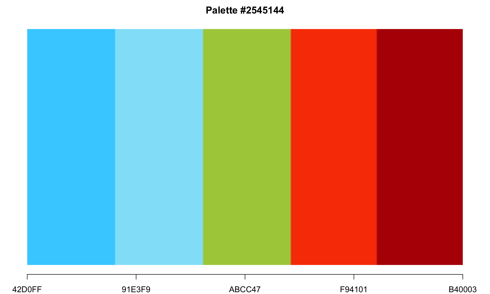
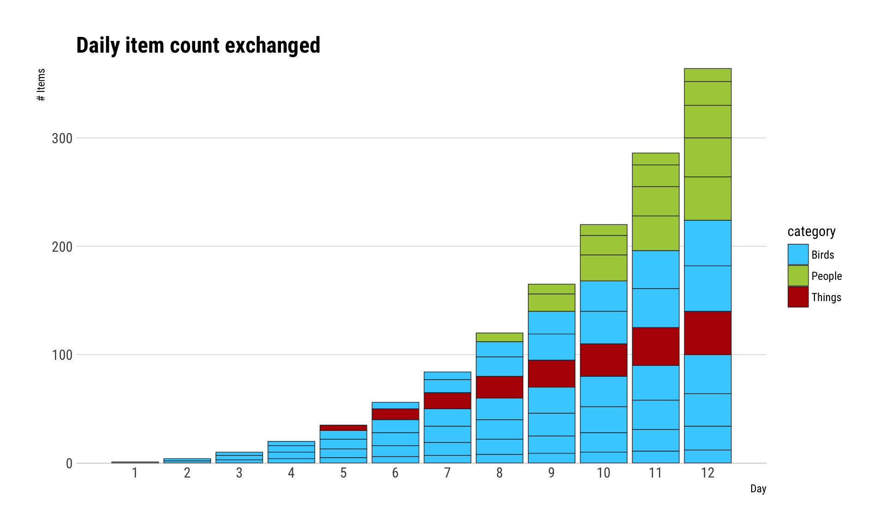
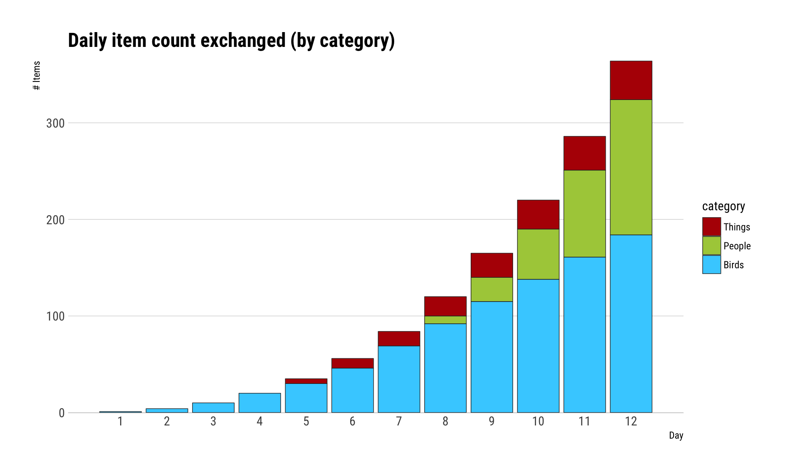
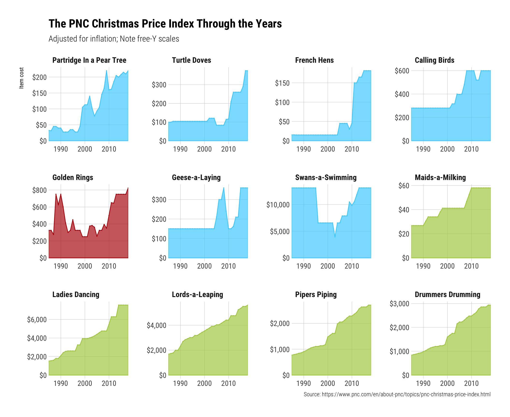
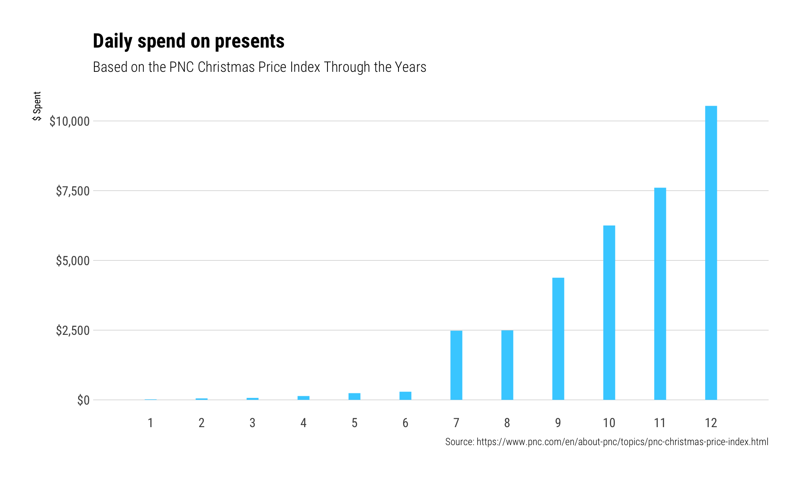
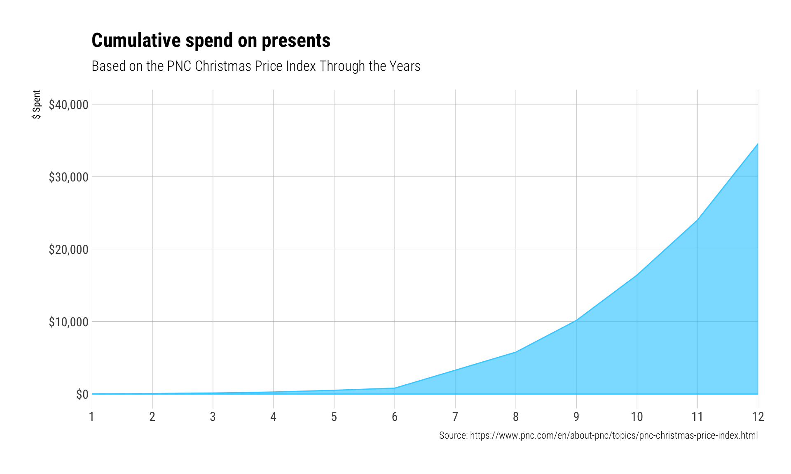

## The Mission
I'm in the market for Christmas presents for my true love, @mrshrbrmstr, and
thought I'd look to an age-old shopping list for inspriation. Just what would
it set me back if I decided to mimic the 12 Days of Christmas in this modern
day and age?

Let's try to do the whole thing in R (of course!).

We'll need to:

- Grab the lyrics
- Parse the lyrics
- Get pricing data
- Compute some statistics
- Make some (hopefully) pretty charts

We'll need some R packages to help us along the way:


```r
library(rprojroot) # where am I?
library(stringi) # better string ops
library(rvest) # web data
library(httr) # web data
library(V8) # work with javascript
library(hrbrthemes) # pretty things
library(colourlovers) # i wanted a christmas palette
library(magick) # magic
library(decapitated) # devtools::install_github("hrbrmstr/decapitated")
library(fuzzyjoin) # data manip
library(tidyverse) # tidyvers
```

I'm also using `knitr`, `kableExtras` and `DT` but provide full (`::`) function
reverences vs pollute the namespace (we've got quite a bit in the namespace as
it stands).


```r
rt <- find_rstudio_root_file()
```

## The stuff
Despite the fact that lyric sites steal content from other sites, they still
put up barriers to scrape said grifted content. So, we have to pick a site without
scraping restrictions, which can mean we get data but may have to massage it a bit.

I found this site and it has what we need, but the content will need work.


```r
decapitated::chrome_shot(
  "http://www.genekeyes.com/12-DAYS/12-days-of-Christmas.html#Lyrics",
  path=file.path(rt, "lyrics.png")
)
```


```r
pg <- read_html("http://www.genekeyes.com/12-DAYS/12-days-of-Christmas.html#Lyrics")
```

We just want to target the table cell with the English lyrics


```r
html_node(pg, xpath=".//td[contains(., 'On the ninth day of Christmas')]") %>%
  html_text() -> lyrics
```

It's a mess


```r
lyrics
```

```
## [1] "                                          The Twelve Days of Christmas\r1On the first day of Christmas, \rmy true love gave to me:A partridge in a pear tree.                                                             \r                                                  \r                                     2\rOn the second day of Christmas,my true love gave to me:Two turtle doves,And a partridge in a pear tree.                                                                   \r\r                                                  3\rOn the third day of Christmas,my true love gave to me:Three French hens,\rTwo turtle doves,And a partridge in a pear tree.         \r                                                                        \r                                                                        \r       4\rOn the fourth day of Christmas,my true love gave to me:\rFour calling birds,\rThree French hens,\rTwo turtle doves,And a partridge in a pear tree.5\rOn the fifth day of Christmas,my true love gave to me:Five golden rings,\rFour calling birds,\rThree French hens,\rTwo turtle doves,And a partridge in a pear tree.6\rOn the sixth day of Christmas,my true love gave to me:\rSix geese a-laying,Five golden rings,\rFour calling birds,\rThree French hens,\rTwo turtle doves,And a partridge in a pear tree.7\rOn the seventh day of Christmas,my true love gave to me:\rSeven swans a-swimming,Six geese a-laying,Five golden rings,\rFour calling birds,\rThree French hens,\rTwo turtle doves,And a partridge in a pear tree.\r8\rOn the eighth day of Christmas,my true love gave to me:\rEight maids a-milking,\rSeven swans a-swimming,Six geese a-laying,Five golden rings,\rFour calling birds,\rThree French hens,\rTwo turtle doves,And a partridge in a pear tree.9\rOn the ninth day of Christmas,my true love gave to me:\rNine ladies dancing,\rEight maids a-milking,\rSeven swans a-swimming,Six geese a-laying,Five golden rings,\rFour calling birds,\rThree French hens,\rTwo turtle doves,And a partridge in a pear tree.\r10\rOn the tenth day of Christmas,my true love gave to me:\rTen lords a-leaping,\rNine ladies dancing,\rEight maids a-milking,\rSeven swans a-swimming,Six geese a-laying,Five golden rings,\rFour calling birds,\rThree French hens,\rTwo turtle doves,And a partridge in a pear tree.\r11\rOn the eleventh day of Christmas,my true love gave to me:Eleven pipers piping,\rTen lords a-leaping,\rNine ladies dancing,\rEight maids a-milking,\rSeven swans a-swimming,Six geese a-laying,Five golden rings,\rFour calling birds,\rThree French hens,\rTwo turtle doves,And a partridge in a pear tree.\r12\rOn the twelfth day of Christmas,my true love gave to me:Twelve drummers drumming,\rEleven pipers piping,\rTen lords a-leaping,\rNine ladies dancing,\rEight maids a-milking,\rSeven swans a-swimming,Six geese a-laying,Five golden rings,\rFour calling birds,\rThree French hens,\rTwo turtle doves,And a partridge in a pear tree.                      "
```

Let's clean it up


```r
lyrics %>%
  stri_replace_first_fixed("1", "1\n") %>%            # fix the first '1'
  gsub("\\.([[:digit:]]{1,2})", "\\.\n\\1\n", .) %>%  # we want all digits on a unique line
  gsub("[,:]", "\n", .) %>%                           # things are smushed together and these are good line-break points if you look at the text
  stri_split_lines() %>%                              # break lines into a char vector
  flatten_chr() %>%                                   # "unlist" it safely
  stri_trim_both() %>%                                # clean up whitespace
  discard(`==`, "") -> lyrics                         # get rid of empty lines
```

Much better


```r
lyrics
```

```
##   [1] "The Twelve Days of Christmas"     "1"                               
##   [3] "On the first day of Christmas"    "my true love gave to me"         
##   [5] "A partridge in a pear tree."      "2"                               
##   [7] "On the second day of Christmas"   "my true love gave to me"         
##   [9] "Two turtle doves"                 "And a partridge in a pear tree." 
##  [11] "3"                                "On the third day of Christmas"   
##  [13] "my true love gave to me"          "Three French hens"               
##  [15] "Two turtle doves"                 "And a partridge in a pear tree." 
##  [17] "4"                                "On the fourth day of Christmas"  
##  [19] "my true love gave to me"          "Four calling birds"              
##  [21] "Three French hens"                "Two turtle doves"                
##  [23] "And a partridge in a pear tree."  "5"                               
##  [25] "On the fifth day of Christmas"    "my true love gave to me"         
##  [27] "Five golden rings"                "Four calling birds"              
##  [29] "Three French hens"                "Two turtle doves"                
##  [31] "And a partridge in a pear tree."  "6"                               
##  [33] "On the sixth day of Christmas"    "my true love gave to me"         
##  [35] "Six geese a-laying"               "Five golden rings"               
##  [37] "Four calling birds"               "Three French hens"               
##  [39] "Two turtle doves"                 "And a partridge in a pear tree." 
##  [41] "7"                                "On the seventh day of Christmas" 
##  [43] "my true love gave to me"          "Seven swans a-swimming"          
##  [45] "Six geese a-laying"               "Five golden rings"               
##  [47] "Four calling birds"               "Three French hens"               
##  [49] "Two turtle doves"                 "And a partridge in a pear tree." 
##  [51] "8"                                "On the eighth day of Christmas"  
##  [53] "my true love gave to me"          "Eight maids a-milking"           
##  [55] "Seven swans a-swimming"           "Six geese a-laying"              
##  [57] "Five golden rings"                "Four calling birds"              
##  [59] "Three French hens"                "Two turtle doves"                
##  [61] "And a partridge in a pear tree."  "9"                               
##  [63] "On the ninth day of Christmas"    "my true love gave to me"         
##  [65] "Nine ladies dancing"              "Eight maids a-milking"           
##  [67] "Seven swans a-swimming"           "Six geese a-laying"              
##  [69] "Five golden rings"                "Four calling birds"              
##  [71] "Three French hens"                "Two turtle doves"                
##  [73] "And a partridge in a pear tree."  "10"                              
##  [75] "On the tenth day of Christmas"    "my true love gave to me"         
##  [77] "Ten lords a-leaping"              "Nine ladies dancing"             
##  [79] "Eight maids a-milking"            "Seven swans a-swimming"          
##  [81] "Six geese a-laying"               "Five golden rings"               
##  [83] "Four calling birds"               "Three French hens"               
##  [85] "Two turtle doves"                 "And a partridge in a pear tree." 
##  [87] "11"                               "On the eleventh day of Christmas"
##  [89] "my true love gave to me"          "Eleven pipers piping"            
##  [91] "Ten lords a-leaping"              "Nine ladies dancing"             
##  [93] "Eight maids a-milking"            "Seven swans a-swimming"          
##  [95] "Six geese a-laying"               "Five golden rings"               
##  [97] "Four calling birds"               "Three French hens"               
##  [99] "Two turtle doves"                 "And a partridge in a pear tree." 
## [101] "12"                               "On the twelfth day of Christmas" 
## [103] "my true love gave to me"          "Twelve drummers drumming"        
## [105] "Eleven pipers piping"             "Ten lords a-leaping"             
## [107] "Nine ladies dancing"              "Eight maids a-milking"           
## [109] "Seven swans a-swimming"           "Six geese a-laying"              
## [111] "Five golden rings"                "Four calling birds"              
## [113] "Three French hens"                "Two turtle doves"                
## [115] "And a partridge in a pear tree."
```

Now, target the days (lines with just a number)

This is a commmon idiom: find the start & end positions of "records" to parse & extract


```r
day_starts <- which(stri_detect_regex(lyrics, "^[[:digit:]]+$"))

length(day_starts) == 12 # if `TRUE` we're :thumbsup:
```

```
## [1] TRUE
```

```r
day_ends <- c(day_starts[-1]-1, length(lyrics))
```

Does it work?


```r
map2(day_starts, day_ends, ~{
  day <- lyrics[.x:.y]
})
```

```
## [[1]]
## [1] "1"                             "On the first day of Christmas"
## [3] "my true love gave to me"       "A partridge in a pear tree."  
## 
## [[2]]
## [1] "2"                               "On the second day of Christmas" 
## [3] "my true love gave to me"         "Two turtle doves"               
## [5] "And a partridge in a pear tree."
## 
## [[3]]
## [1] "3"                               "On the third day of Christmas"  
## [3] "my true love gave to me"         "Three French hens"              
## [5] "Two turtle doves"                "And a partridge in a pear tree."
## 
## [[4]]
## [1] "4"                               "On the fourth day of Christmas" 
## [3] "my true love gave to me"         "Four calling birds"             
## [5] "Three French hens"               "Two turtle doves"               
## [7] "And a partridge in a pear tree."
## 
## [[5]]
## [1] "5"                               "On the fifth day of Christmas"  
## [3] "my true love gave to me"         "Five golden rings"              
## [5] "Four calling birds"              "Three French hens"              
## [7] "Two turtle doves"                "And a partridge in a pear tree."
## 
## [[6]]
## [1] "6"                               "On the sixth day of Christmas"  
## [3] "my true love gave to me"         "Six geese a-laying"             
## [5] "Five golden rings"               "Four calling birds"             
## [7] "Three French hens"               "Two turtle doves"               
## [9] "And a partridge in a pear tree."
## 
## [[7]]
##  [1] "7"                               "On the seventh day of Christmas"
##  [3] "my true love gave to me"         "Seven swans a-swimming"         
##  [5] "Six geese a-laying"              "Five golden rings"              
##  [7] "Four calling birds"              "Three French hens"              
##  [9] "Two turtle doves"                "And a partridge in a pear tree."
## 
## [[8]]
##  [1] "8"                               "On the eighth day of Christmas" 
##  [3] "my true love gave to me"         "Eight maids a-milking"          
##  [5] "Seven swans a-swimming"          "Six geese a-laying"             
##  [7] "Five golden rings"               "Four calling birds"             
##  [9] "Three French hens"               "Two turtle doves"               
## [11] "And a partridge in a pear tree."
## 
## [[9]]
##  [1] "9"                               "On the ninth day of Christmas"  
##  [3] "my true love gave to me"         "Nine ladies dancing"            
##  [5] "Eight maids a-milking"           "Seven swans a-swimming"         
##  [7] "Six geese a-laying"              "Five golden rings"              
##  [9] "Four calling birds"              "Three French hens"              
## [11] "Two turtle doves"                "And a partridge in a pear tree."
## 
## [[10]]
##  [1] "10"                              "On the tenth day of Christmas"  
##  [3] "my true love gave to me"         "Ten lords a-leaping"            
##  [5] "Nine ladies dancing"             "Eight maids a-milking"          
##  [7] "Seven swans a-swimming"          "Six geese a-laying"             
##  [9] "Five golden rings"               "Four calling birds"             
## [11] "Three French hens"               "Two turtle doves"               
## [13] "And a partridge in a pear tree."
## 
## [[11]]
##  [1] "11"                               "On the eleventh day of Christmas"
##  [3] "my true love gave to me"          "Eleven pipers piping"            
##  [5] "Ten lords a-leaping"              "Nine ladies dancing"             
##  [7] "Eight maids a-milking"            "Seven swans a-swimming"          
##  [9] "Six geese a-laying"               "Five golden rings"               
## [11] "Four calling birds"               "Three French hens"               
## [13] "Two turtle doves"                 "And a partridge in a pear tree." 
## 
## [[12]]
##  [1] "12"                              "On the twelfth day of Christmas"
##  [3] "my true love gave to me"         "Twelve drummers drumming"       
##  [5] "Eleven pipers piping"            "Ten lords a-leaping"            
##  [7] "Nine ladies dancing"             "Eight maids a-milking"          
##  [9] "Seven swans a-swimming"          "Six geese a-laying"             
## [11] "Five golden rings"               "Four calling birds"             
## [13] "Three French hens"               "Two turtle doves"               
## [15] "And a partridge in a pear tree."
```

Cool. So, now we need to tidy this up a bit. We ultimately want a data frame with
the `day` number, the `amount` of the item given on the day and the `item` itself.

We'll build a regex and a table from a set of english value names.


```r
amounts <- c("a", "A", "Two", "Three", "Four", "Five", "Six", "Seven", "Eight", "Nine", "Ten", "Eleven", "Twelve")
amt_trans <- set_names(c(1,1:12), amounts)
item_regex <- sprintf("(%s) ([[:graph:] ]+)$", paste0(amounts, collapse="|"))
```

Iterate over each segment containing a record


```r
map2_df(day_starts, day_ends, ~{

  day <- lyrics[.x:.y] # this is just for shorthand use but it's the raw record

  day_number <- as.numeric(day[1]) # it's a char now so we want numeric

  stri_match_first_regex(day, item_regex) %>%                         # this makes a matrix of the extracted regex groups based on the regex we built earlier
    as_data_frame() %>%
    filter(!is.na(V1)) %>%                                            # quick hack to get rid of non-gift enumeration lines
    mutate(day = day_number, V3 = sub(".", "", V3, fixed=TRUE)) %>%   # get rid of trailing "."'s and add a day column
    select(day, amount=V2, item=V3) %>%
    mutate(amount = amt_trans[amount])                                # use the translation table we built to get a numeric amount

}) -> day_items
```

How'd we do?


```r
DT::datatable(day_items)
```

<!--html_preserve--><div id="htmlwidget-3427c580215bd658f7c3" style="width:100%;height:auto;" class="datatables html-widget"></div>
<script type="application/json" data-for="htmlwidget-3427c580215bd658f7c3">{"x":{"filter":"none","data":[["1","2","3","4","5","6","7","8","9","10","11","12","13","14","15","16","17","18","19","20","21","22","23","24","25","26","27","28","29","30","31","32","33","34","35","36","37","38","39","40","41","42","43","44","45","46","47","48","49","50","51","52","53","54","55","56","57","58","59","60","61","62","63","64","65","66","67","68","69","70","71","72","73","74","75","76","77","78"],[1,2,2,3,3,3,4,4,4,4,5,5,5,5,5,6,6,6,6,6,6,7,7,7,7,7,7,7,8,8,8,8,8,8,8,8,9,9,9,9,9,9,9,9,9,10,10,10,10,10,10,10,10,10,10,11,11,11,11,11,11,11,11,11,11,11,12,12,12,12,12,12,12,12,12,12,12,12],[1,2,1,3,2,1,4,3,2,1,5,4,3,2,1,6,5,4,3,2,1,7,6,5,4,3,2,1,8,7,6,5,4,3,2,1,9,8,7,6,5,4,3,2,1,10,9,8,7,6,5,4,3,2,1,11,10,9,8,7,6,5,4,3,2,1,12,11,10,9,8,7,6,5,4,3,2,1],["partridge in a pear tree","turtle doves","partridge in a pear tree","French hens","turtle doves","partridge in a pear tree","calling birds","French hens","turtle doves","partridge in a pear tree","golden rings","calling birds","French hens","turtle doves","partridge in a pear tree","geese a-laying","golden rings","calling birds","French hens","turtle doves","partridge in a pear tree","swans a-swimming","geese a-laying","golden rings","calling birds","French hens","turtle doves","partridge in a pear tree","maids a-milking","swans a-swimming","geese a-laying","golden rings","calling birds","French hens","turtle doves","partridge in a pear tree","ladies dancing","maids a-milking","swans a-swimming","geese a-laying","golden rings","calling birds","French hens","turtle doves","partridge in a pear tree","lords a-leaping","ladies dancing","maids a-milking","swans a-swimming","geese a-laying","golden rings","calling birds","French hens","turtle doves","partridge in a pear tree","pipers piping","lords a-leaping","ladies dancing","maids a-milking","swans a-swimming","geese a-laying","golden rings","calling birds","French hens","turtle doves","partridge in a pear tree","drummers drumming","pipers piping","lords a-leaping","ladies dancing","maids a-milking","swans a-swimming","geese a-laying","golden rings","calling birds","French hens","turtle doves","partridge in a pear tree"]],"container":"<table class=\"display\">\n  <thead>\n    <tr>\n      <th> <\/th>\n      <th>day<\/th>\n      <th>amount<\/th>\n      <th>item<\/th>\n    <\/tr>\n  <\/thead>\n<\/table>","options":{"columnDefs":[{"className":"dt-right","targets":[1,2]},{"orderable":false,"targets":0}],"order":[],"autoWidth":false,"orderClasses":false}},"evals":[],"jsHooks":[]}</script><!--/html_preserve-->

For fun, we'll add categories for the items, which is straightforward with `case_when()`:


```r
mutate(
  day_items,
  category = case_when(
    stri_detect_regex(item, "(bird|hen|geese|part|swan|dove)") ~ "Birds",
    stri_detect_regex(item, "(lord|drummer|ladies|piper|maid)") ~ "People",
    TRUE ~ "Things"
  )
) -> day_items
```

Said categories will also help us color things (a 3-color palette is easy, a decent
12-color palette is not so easy, so we'll color by category when possible).
Still looking good?


```r
DT::datatable(day_items)
```

<!--html_preserve--><div id="htmlwidget-c9551d5fded099e584df" style="width:100%;height:auto;" class="datatables html-widget"></div>
<script type="application/json" data-for="htmlwidget-c9551d5fded099e584df">{"x":{"filter":"none","data":[["1","2","3","4","5","6","7","8","9","10","11","12","13","14","15","16","17","18","19","20","21","22","23","24","25","26","27","28","29","30","31","32","33","34","35","36","37","38","39","40","41","42","43","44","45","46","47","48","49","50","51","52","53","54","55","56","57","58","59","60","61","62","63","64","65","66","67","68","69","70","71","72","73","74","75","76","77","78"],[1,2,2,3,3,3,4,4,4,4,5,5,5,5,5,6,6,6,6,6,6,7,7,7,7,7,7,7,8,8,8,8,8,8,8,8,9,9,9,9,9,9,9,9,9,10,10,10,10,10,10,10,10,10,10,11,11,11,11,11,11,11,11,11,11,11,12,12,12,12,12,12,12,12,12,12,12,12],[1,2,1,3,2,1,4,3,2,1,5,4,3,2,1,6,5,4,3,2,1,7,6,5,4,3,2,1,8,7,6,5,4,3,2,1,9,8,7,6,5,4,3,2,1,10,9,8,7,6,5,4,3,2,1,11,10,9,8,7,6,5,4,3,2,1,12,11,10,9,8,7,6,5,4,3,2,1],["partridge in a pear tree","turtle doves","partridge in a pear tree","French hens","turtle doves","partridge in a pear tree","calling birds","French hens","turtle doves","partridge in a pear tree","golden rings","calling birds","French hens","turtle doves","partridge in a pear tree","geese a-laying","golden rings","calling birds","French hens","turtle doves","partridge in a pear tree","swans a-swimming","geese a-laying","golden rings","calling birds","French hens","turtle doves","partridge in a pear tree","maids a-milking","swans a-swimming","geese a-laying","golden rings","calling birds","French hens","turtle doves","partridge in a pear tree","ladies dancing","maids a-milking","swans a-swimming","geese a-laying","golden rings","calling birds","French hens","turtle doves","partridge in a pear tree","lords a-leaping","ladies dancing","maids a-milking","swans a-swimming","geese a-laying","golden rings","calling birds","French hens","turtle doves","partridge in a pear tree","pipers piping","lords a-leaping","ladies dancing","maids a-milking","swans a-swimming","geese a-laying","golden rings","calling birds","French hens","turtle doves","partridge in a pear tree","drummers drumming","pipers piping","lords a-leaping","ladies dancing","maids a-milking","swans a-swimming","geese a-laying","golden rings","calling birds","French hens","turtle doves","partridge in a pear tree"],["Birds","Birds","Birds","Birds","Birds","Birds","Birds","Birds","Birds","Birds","Things","Birds","Birds","Birds","Birds","Birds","Things","Birds","Birds","Birds","Birds","Birds","Birds","Things","Birds","Birds","Birds","Birds","People","Birds","Birds","Things","Birds","Birds","Birds","Birds","People","People","Birds","Birds","Things","Birds","Birds","Birds","Birds","People","People","People","Birds","Birds","Things","Birds","Birds","Birds","Birds","People","People","People","People","Birds","Birds","Things","Birds","Birds","Birds","Birds","People","People","People","People","People","Birds","Birds","Things","Birds","Birds","Birds","Birds"]],"container":"<table class=\"display\">\n  <thead>\n    <tr>\n      <th> <\/th>\n      <th>day<\/th>\n      <th>amount<\/th>\n      <th>item<\/th>\n      <th>category<\/th>\n    <\/tr>\n  <\/thead>\n<\/table>","options":{"columnDefs":[{"className":"dt-right","targets":[1,2]},{"orderable":false,"targets":0}],"order":[],"autoWidth":false,"orderClasses":false}},"evals":[],"jsHooks":[]}</script><!--/html_preserve-->

Let's grab a decent palette


```r
xmas <- colourlovers::clpalette(2545144)
```

```r
plot(xmas)
```



Let's look first at the daily item count exchanged. I'm usually #notafan of
stacked bar charts but I think they work OK here.


```r
group_by(day_items, item) %>%
  mutate(item_cum = cumsum(amount)) %>%
  ungroup() -> day_item_sums
```

```r
mutate(day_item_sums, item = factor(item, levels=rev(unique(item)))) %>%
  ggplot(aes(x=day, y=item_cum, group=item, fill=category)) +
  geom_col(position="stack", color="#2b2b2b", size=0.25) +
  scale_x_comma(limits=c(0, 13), breaks=1:12) +
  scale_y_continuous(expand=c(0,0.5)) +
  scale_fill_manual(values=swatch(xmas)[[1]][c(1,3,5)]) +
  labs(x="Day", y="# Items", title="Daily item count exchanged") +
  theme_ipsum_rc(grid="Y", axis="x")
```



How about the same by category?


```r
count(day_items, day, category, wt=amount) %>%
  arrange(day) %>%
  group_by(category) %>%
  mutate(cat_cum = cumsum(n)) %>%
  ungroup() %>%
  mutate(category = factor(category, levels=rev(c("Birds", "People", "Things")))) %>%
  ggplot(aes(x=day, y=cat_cum, group=category, fill=category)) +
  geom_col(position="stack", color="#2b2b2b", size=0.25) +
  scale_x_comma(limits=c(0, 13), breaks=1:12) +
  scale_y_continuous(expand=c(0,0.5)) +
  scale_fill_manual(values=swatch(xmas)[[1]][c(1,3,5)]) +
  labs(x="Day", y="# Items", title="Daily item count exchanged (by category)") +
  theme_ipsum_rc(grid="Y", axis="x")
```



Here's the total #'s for each item at the end of the 12 days:


```r
count(day_items, item, wt=amount) %>%
  arrange(desc(n)) %>%
  knitr::kable(align="rl", format="html") %>%
  kableExtra::kable_styling(full_width=FALSE)
```

<table class="table" style="width: auto !important; margin-left: auto; margin-right: auto;">
<thead><tr>
<th style="text-align:right;"> item </th>
   <th style="text-align:left;"> n </th>
  </tr></thead>
<tbody>
<tr>
<td style="text-align:right;"> geese a-laying </td>
   <td style="text-align:left;"> 42 </td>
  </tr>
<tr>
<td style="text-align:right;"> swans a-swimming </td>
   <td style="text-align:left;"> 42 </td>
  </tr>
<tr>
<td style="text-align:right;"> golden rings </td>
   <td style="text-align:left;"> 40 </td>
  </tr>
<tr>
<td style="text-align:right;"> maids a-milking </td>
   <td style="text-align:left;"> 40 </td>
  </tr>
<tr>
<td style="text-align:right;"> calling birds </td>
   <td style="text-align:left;"> 36 </td>
  </tr>
<tr>
<td style="text-align:right;"> ladies dancing </td>
   <td style="text-align:left;"> 36 </td>
  </tr>
<tr>
<td style="text-align:right;"> French hens </td>
   <td style="text-align:left;"> 30 </td>
  </tr>
<tr>
<td style="text-align:right;"> lords a-leaping </td>
   <td style="text-align:left;"> 30 </td>
  </tr>
<tr>
<td style="text-align:right;"> pipers piping </td>
   <td style="text-align:left;"> 22 </td>
  </tr>
<tr>
<td style="text-align:right;"> turtle doves </td>
   <td style="text-align:left;"> 22 </td>
  </tr>
<tr>
<td style="text-align:right;"> drummers drumming </td>
   <td style="text-align:left;"> 12 </td>
  </tr>
<tr>
<td style="text-align:right;"> partridge in a pear tree </td>
   <td style="text-align:left;"> 12 </td>
  </tr>
</tbody>
</table>

## The cost
PNC bank computes the annual costs of the 12 Days of Christmas each year and
publishes a fun (for a financial institution) [Christmas Price Index](https://www.pnc.com/en/about-pnc/topics/pnc-christmas-price-index.html).


```r
decapitated::chrome_shot(
  "https://www.pnc.com/en/about-pnc/topics/pnc-christmas-price-index.html",
  path=file.path(rt, "png.png")
)
```


We can work with the raw data (they encourage using this site/data in educational contexts) whic
can be found in a javascript file that gets loaded with the page. Use Developer Tools
and refresh the page with Developer Tools up and examine the tabs to see where this comes from.


```r
res <- GET("https://www.pnc.com/content/dam/pnc-com/code_assets/cpi/cpi-chart-data.js")

decapitated::chrome_shot(
  "https://www.pnc.com/content/dam/pnc-com/code_assets/cpi/cpi-chart-data.js",
  path=file.path(rt, "viewsrc.png")
)
```


But, we have a problem. It's javascript, not JSON or XML. Thankfully, it's
literally just data declarations and no DOM machinations, so we can use the `V8` package
to pass the javascript to the V8 engine for execution and then marshal the data back to R.


```r
ctx <- v8()
ctx$eval(content(res, as="text", encoding="UTF-8"))

str(data_init <- ctx$get("dataInit"))
```

```
## List of 2
##  $ labels  : chr [1:34] "1984" "1985" "1986" "1987" ...
##  $ datasets:'data.frame':	1 obs. of  2 variables:
##   ..$ label: chr "All Gifts"
##   ..$ data :List of 1
##   .. ..$ : num [1:34] 18846 18988 19095 20047 19960 ...
```

```r
str(data_group <- ctx$get("dataGroup"))
```

```
## 'data.frame':	13 obs. of  2 variables:
##  $ label: chr  "All Gifts" "Partridge In a Pear Tree" "Turtle Doves" "French Hens" ...
##  $ data :List of 13
##   ..$ : num  18846 18988 19095 20047 19960 ...
##   ..$ : num  32.5 31.5 45 45 40 ...
##   ..$ : num  99.3 99.3 104 104 104 ...
##   ..$ : num  15.2 15.2 15 15 15 ...
##   ..$ : num  280 280 280 280 280 280 280 280 280 280 ...
##   ..$ : num  325 325 275 750 625 ...
##   ..$ : int  150 150 150 150 150 150 150 150 150 150 ...
##   ..$ : num  13121 13121 13121 13121 13121 ...
##   ..$ : num  26.8 26.8 26.8 26.8 26.8 26.8 30.4 34 34 34 ...
##   ..$ : num  1512 1557 1602 1800 1800 ...
##   ..$ : num  1680 1730 1780 2000 2000 ...
##   ..$ : num  770 793 814 842 863 ...
##   ..$ : num  834 859 882 913 935 ...
```

We need to do a bit of work to make it usabe:


```r
set_names(data_group$data, data_group$label) %>%
  bind_cols() %>%
  mutate(year = data_init$labels) %>%
  gather(item_display_name, cost, -year) %>%
  mutate(item = tolower(gsub("-", " ", item_display_name, fixed=TRUE))) -> annual_item_costs

DT::datatable(annual_item_costs)
```

<!--html_preserve--><div id="htmlwidget-f150c17c3a3f5bb8a4a9" style="width:100%;height:auto;" class="datatables html-widget"></div>
<script type="application/json" data-for="htmlwidget-f150c17c3a3f5bb8a4a9">{"x":{"filter":"none","data":[["1","2","3","4","5","6","7","8","9","10","11","12","13","14","15","16","17","18","19","20","21","22","23","24","25","26","27","28","29","30","31","32","33","34","35","36","37","38","39","40","41","42","43","44","45","46","47","48","49","50","51","52","53","54","55","56","57","58","59","60","61","62","63","64","65","66","67","68","69","70","71","72","73","74","75","76","77","78","79","80","81","82","83","84","85","86","87","88","89","90","91","92","93","94","95","96","97","98","99","100","101","102","103","104","105","106","107","108","109","110","111","112","113","114","115","116","117","118","119","120","121","122","123","124","125","126","127","128","129","130","131","132","133","134","135","136","137","138","139","140","141","142","143","144","145","146","147","148","149","150","151","152","153","154","155","156","157","158","159","160","161","162","163","164","165","166","167","168","169","170","171","172","173","174","175","176","177","178","179","180","181","182","183","184","185","186","187","188","189","190","191","192","193","194","195","196","197","198","199","200","201","202","203","204","205","206","207","208","209","210","211","212","213","214","215","216","217","218","219","220","221","222","223","224","225","226","227","228","229","230","231","232","233","234","235","236","237","238","239","240","241","242","243","244","245","246","247","248","249","250","251","252","253","254","255","256","257","258","259","260","261","262","263","264","265","266","267","268","269","270","271","272","273","274","275","276","277","278","279","280","281","282","283","284","285","286","287","288","289","290","291","292","293","294","295","296","297","298","299","300","301","302","303","304","305","306","307","308","309","310","311","312","313","314","315","316","317","318","319","320","321","322","323","324","325","326","327","328","329","330","331","332","333","334","335","336","337","338","339","340","341","342","343","344","345","346","347","348","349","350","351","352","353","354","355","356","357","358","359","360","361","362","363","364","365","366","367","368","369","370","371","372","373","374","375","376","377","378","379","380","381","382","383","384","385","386","387","388","389","390","391","392","393","394","395","396","397","398","399","400","401","402","403","404","405","406","407","408","409","410","411","412","413","414","415","416","417","418","419","420","421","422","423","424","425","426","427","428","429","430","431","432","433","434","435","436","437","438","439","440","441","442"],["1984","1985","1986","1987","1988","1989","1990","1991","1992","1993","1994","1995","1996","1997","1998","1999","2000","2001","2002","2003","2004","2005","2006","2007","2008","2009","2010","2011","2012","2013","2014","2015","2016","2017","1984","1985","1986","1987","1988","1989","1990","1991","1992","1993","1994","1995","1996","1997","1998","1999","2000","2001","2002","2003","2004","2005","2006","2007","2008","2009","2010","2011","2012","2013","2014","2015","2016","2017","1984","1985","1986","1987","1988","1989","1990","1991","1992","1993","1994","1995","1996","1997","1998","1999","2000","2001","2002","2003","2004","2005","2006","2007","2008","2009","2010","2011","2012","2013","2014","2015","2016","2017","1984","1985","1986","1987","1988","1989","1990","1991","1992","1993","1994","1995","1996","1997","1998","1999","2000","2001","2002","2003","2004","2005","2006","2007","2008","2009","2010","2011","2012","2013","2014","2015","2016","2017","1984","1985","1986","1987","1988","1989","1990","1991","1992","1993","1994","1995","1996","1997","1998","1999","2000","2001","2002","2003","2004","2005","2006","2007","2008","2009","2010","2011","2012","2013","2014","2015","2016","2017","1984","1985","1986","1987","1988","1989","1990","1991","1992","1993","1994","1995","1996","1997","1998","1999","2000","2001","2002","2003","2004","2005","2006","2007","2008","2009","2010","2011","2012","2013","2014","2015","2016","2017","1984","1985","1986","1987","1988","1989","1990","1991","1992","1993","1994","1995","1996","1997","1998","1999","2000","2001","2002","2003","2004","2005","2006","2007","2008","2009","2010","2011","2012","2013","2014","2015","2016","2017","1984","1985","1986","1987","1988","1989","1990","1991","1992","1993","1994","1995","1996","1997","1998","1999","2000","2001","2002","2003","2004","2005","2006","2007","2008","2009","2010","2011","2012","2013","2014","2015","2016","2017","1984","1985","1986","1987","1988","1989","1990","1991","1992","1993","1994","1995","1996","1997","1998","1999","2000","2001","2002","2003","2004","2005","2006","2007","2008","2009","2010","2011","2012","2013","2014","2015","2016","2017","1984","1985","1986","1987","1988","1989","1990","1991","1992","1993","1994","1995","1996","1997","1998","1999","2000","2001","2002","2003","2004","2005","2006","2007","2008","2009","2010","2011","2012","2013","2014","2015","2016","2017","1984","1985","1986","1987","1988","1989","1990","1991","1992","1993","1994","1995","1996","1997","1998","1999","2000","2001","2002","2003","2004","2005","2006","2007","2008","2009","2010","2011","2012","2013","2014","2015","2016","2017","1984","1985","1986","1987","1988","1989","1990","1991","1992","1993","1994","1995","1996","1997","1998","1999","2000","2001","2002","2003","2004","2005","2006","2007","2008","2009","2010","2011","2012","2013","2014","2015","2016","2017","1984","1985","1986","1987","1988","1989","1990","1991","1992","1993","1994","1995","1996","1997","1998","1999","2000","2001","2002","2003","2004","2005","2006","2007","2008","2009","2010","2011","2012","2013","2014","2015","2016","2017"],["All Gifts","All Gifts","All Gifts","All Gifts","All Gifts","All Gifts","All Gifts","All Gifts","All Gifts","All Gifts","All Gifts","All Gifts","All Gifts","All Gifts","All Gifts","All Gifts","All Gifts","All Gifts","All Gifts","All Gifts","All Gifts","All Gifts","All Gifts","All Gifts","All Gifts","All Gifts","All Gifts","All Gifts","All Gifts","All Gifts","All Gifts","All Gifts","All Gifts","All Gifts","Partridge In a Pear Tree","Partridge In a Pear Tree","Partridge In a Pear Tree","Partridge In a Pear Tree","Partridge In a Pear Tree","Partridge In a Pear Tree","Partridge In a Pear Tree","Partridge In a Pear Tree","Partridge In a Pear Tree","Partridge In a Pear Tree","Partridge In a Pear Tree","Partridge In a Pear Tree","Partridge In a Pear Tree","Partridge In a Pear Tree","Partridge In a Pear Tree","Partridge In a Pear Tree","Partridge In a Pear Tree","Partridge In a Pear Tree","Partridge In a Pear Tree","Partridge In a Pear Tree","Partridge In a Pear Tree","Partridge In a Pear Tree","Partridge In a Pear Tree","Partridge In a Pear Tree","Partridge In a Pear Tree","Partridge In a Pear Tree","Partridge In a Pear Tree","Partridge In a Pear Tree","Partridge In a Pear Tree","Partridge In a Pear Tree","Partridge In a Pear Tree","Partridge In a Pear Tree","Partridge In a Pear Tree","Partridge In a Pear Tree","Turtle Doves","Turtle Doves","Turtle Doves","Turtle Doves","Turtle Doves","Turtle Doves","Turtle Doves","Turtle Doves","Turtle Doves","Turtle Doves","Turtle Doves","Turtle Doves","Turtle Doves","Turtle Doves","Turtle Doves","Turtle Doves","Turtle Doves","Turtle Doves","Turtle Doves","Turtle Doves","Turtle Doves","Turtle Doves","Turtle Doves","Turtle Doves","Turtle Doves","Turtle Doves","Turtle Doves","Turtle Doves","Turtle Doves","Turtle Doves","Turtle Doves","Turtle Doves","Turtle Doves","Turtle Doves","French Hens","French Hens","French Hens","French Hens","French Hens","French Hens","French Hens","French Hens","French Hens","French Hens","French Hens","French Hens","French Hens","French Hens","French Hens","French Hens","French Hens","French Hens","French Hens","French Hens","French Hens","French Hens","French Hens","French Hens","French Hens","French Hens","French Hens","French Hens","French Hens","French Hens","French Hens","French Hens","French Hens","French Hens","Calling Birds","Calling Birds","Calling Birds","Calling Birds","Calling Birds","Calling Birds","Calling Birds","Calling Birds","Calling Birds","Calling Birds","Calling Birds","Calling Birds","Calling Birds","Calling Birds","Calling Birds","Calling Birds","Calling Birds","Calling Birds","Calling Birds","Calling Birds","Calling Birds","Calling Birds","Calling Birds","Calling Birds","Calling Birds","Calling Birds","Calling Birds","Calling Birds","Calling Birds","Calling Birds","Calling Birds","Calling Birds","Calling Birds","Calling Birds","Golden Rings","Golden Rings","Golden Rings","Golden Rings","Golden Rings","Golden Rings","Golden Rings","Golden Rings","Golden Rings","Golden Rings","Golden Rings","Golden Rings","Golden Rings","Golden Rings","Golden Rings","Golden Rings","Golden Rings","Golden Rings","Golden Rings","Golden Rings","Golden Rings","Golden Rings","Golden Rings","Golden Rings","Golden Rings","Golden Rings","Golden Rings","Golden Rings","Golden Rings","Golden Rings","Golden Rings","Golden Rings","Golden Rings","Golden Rings","Geese-a-Laying","Geese-a-Laying","Geese-a-Laying","Geese-a-Laying","Geese-a-Laying","Geese-a-Laying","Geese-a-Laying","Geese-a-Laying","Geese-a-Laying","Geese-a-Laying","Geese-a-Laying","Geese-a-Laying","Geese-a-Laying","Geese-a-Laying","Geese-a-Laying","Geese-a-Laying","Geese-a-Laying","Geese-a-Laying","Geese-a-Laying","Geese-a-Laying","Geese-a-Laying","Geese-a-Laying","Geese-a-Laying","Geese-a-Laying","Geese-a-Laying","Geese-a-Laying","Geese-a-Laying","Geese-a-Laying","Geese-a-Laying","Geese-a-Laying","Geese-a-Laying","Geese-a-Laying","Geese-a-Laying","Geese-a-Laying","Swans-a-Swimming","Swans-a-Swimming","Swans-a-Swimming","Swans-a-Swimming","Swans-a-Swimming","Swans-a-Swimming","Swans-a-Swimming","Swans-a-Swimming","Swans-a-Swimming","Swans-a-Swimming","Swans-a-Swimming","Swans-a-Swimming","Swans-a-Swimming","Swans-a-Swimming","Swans-a-Swimming","Swans-a-Swimming","Swans-a-Swimming","Swans-a-Swimming","Swans-a-Swimming","Swans-a-Swimming","Swans-a-Swimming","Swans-a-Swimming","Swans-a-Swimming","Swans-a-Swimming","Swans-a-Swimming","Swans-a-Swimming","Swans-a-Swimming","Swans-a-Swimming","Swans-a-Swimming","Swans-a-Swimming","Swans-a-Swimming","Swans-a-Swimming","Swans-a-Swimming","Swans-a-Swimming","Maids-a-Milking","Maids-a-Milking","Maids-a-Milking","Maids-a-Milking","Maids-a-Milking","Maids-a-Milking","Maids-a-Milking","Maids-a-Milking","Maids-a-Milking","Maids-a-Milking","Maids-a-Milking","Maids-a-Milking","Maids-a-Milking","Maids-a-Milking","Maids-a-Milking","Maids-a-Milking","Maids-a-Milking","Maids-a-Milking","Maids-a-Milking","Maids-a-Milking","Maids-a-Milking","Maids-a-Milking","Maids-a-Milking","Maids-a-Milking","Maids-a-Milking","Maids-a-Milking","Maids-a-Milking","Maids-a-Milking","Maids-a-Milking","Maids-a-Milking","Maids-a-Milking","Maids-a-Milking","Maids-a-Milking","Maids-a-Milking","Ladies Dancing","Ladies Dancing","Ladies Dancing","Ladies Dancing","Ladies Dancing","Ladies Dancing","Ladies Dancing","Ladies Dancing","Ladies Dancing","Ladies Dancing","Ladies Dancing","Ladies Dancing","Ladies Dancing","Ladies Dancing","Ladies Dancing","Ladies Dancing","Ladies Dancing","Ladies Dancing","Ladies Dancing","Ladies Dancing","Ladies Dancing","Ladies Dancing","Ladies Dancing","Ladies Dancing","Ladies Dancing","Ladies Dancing","Ladies Dancing","Ladies Dancing","Ladies Dancing","Ladies Dancing","Ladies Dancing","Ladies Dancing","Ladies Dancing","Ladies Dancing","Lords-a-Leaping","Lords-a-Leaping","Lords-a-Leaping","Lords-a-Leaping","Lords-a-Leaping","Lords-a-Leaping","Lords-a-Leaping","Lords-a-Leaping","Lords-a-Leaping","Lords-a-Leaping","Lords-a-Leaping","Lords-a-Leaping","Lords-a-Leaping","Lords-a-Leaping","Lords-a-Leaping","Lords-a-Leaping","Lords-a-Leaping","Lords-a-Leaping","Lords-a-Leaping","Lords-a-Leaping","Lords-a-Leaping","Lords-a-Leaping","Lords-a-Leaping","Lords-a-Leaping","Lords-a-Leaping","Lords-a-Leaping","Lords-a-Leaping","Lords-a-Leaping","Lords-a-Leaping","Lords-a-Leaping","Lords-a-Leaping","Lords-a-Leaping","Lords-a-Leaping","Lords-a-Leaping","Pipers Piping","Pipers Piping","Pipers Piping","Pipers Piping","Pipers Piping","Pipers Piping","Pipers Piping","Pipers Piping","Pipers Piping","Pipers Piping","Pipers Piping","Pipers Piping","Pipers Piping","Pipers Piping","Pipers Piping","Pipers Piping","Pipers Piping","Pipers Piping","Pipers Piping","Pipers Piping","Pipers Piping","Pipers Piping","Pipers Piping","Pipers Piping","Pipers Piping","Pipers Piping","Pipers Piping","Pipers Piping","Pipers Piping","Pipers Piping","Pipers Piping","Pipers Piping","Pipers Piping","Pipers Piping","Drummers Drumming","Drummers Drumming","Drummers Drumming","Drummers Drumming","Drummers Drumming","Drummers Drumming","Drummers Drumming","Drummers Drumming","Drummers Drumming","Drummers Drumming","Drummers Drumming","Drummers Drumming","Drummers Drumming","Drummers Drumming","Drummers Drumming","Drummers Drumming","Drummers Drumming","Drummers Drumming","Drummers Drumming","Drummers Drumming","Drummers Drumming","Drummers Drumming","Drummers Drumming","Drummers Drumming","Drummers Drumming","Drummers Drumming","Drummers Drumming","Drummers Drumming","Drummers Drumming","Drummers Drumming","Drummers Drumming","Drummers Drumming","Drummers Drumming","Drummers Drumming"],[18845.97,18988.44,19095.11,20046.61,19960.49,20773.64,21406.58,21630.65,21756.82,21935.56,22119.06,15596.08,16310.29,16458.29,17329.33,18054.6,18324.65,18871.88,16456.95,20008.36,20400.55,22064.6,22636.32,23222.98,26036.21,26116.69,28447.38,29910.68,31691.18,33653.17,33933.22,34130.99,34363.49,34558.65,32.52,31.52,44.95,44.95,39.95,39.95,27.48,27.5,27.5,34.99,34.99,27.5,27.5,45,104.99,113,113,140,102.5,77.5,93,104.99,144.99,164.99,219.99,159.99,161.99,184.99,204.99,199.99,207.68,214.99,209.99,219.95,99.28,99.28,104,104,104,104,104,104,104,104,104,104,104,104,104,104,104,120.64,120.64,120.64,83.2,83.2,83.2,83.2,114.4,116.44,208,260,260,260,260,290,375,375,15.23,15.23,15,15,15,15,15,15,15,15,15,15,15,15,15,15,15,15,15,15,45,45,45,45,30,45,150,150,165,165,181.5,181.5,181.5,181.5,280,280,280,280,280,280,280,280,280,280,280,280,280,280,280,280,280,316,316,400,396,399.96,479.96,599.96,599.96,599.96,599.96,519.96,519.96,599.96,599.96,599.96,599.96,599.96,325,325,275,750,625,750,600,412.5,300,325,450,325,325,325,250,250,250,375,382.5,361.25,255,325,325,395,349.95,499.95,649.95,645,750,750,750,750,750,825,150,150,150,150,150,150,150,150,150,150,150,150,150,150,150,150,150,150,150,150,210,300,300,360,240,150,150,162,210,210,360,360,360,360,13120.86,13120.86,13120.86,13120.86,13120.86,13120.86,13120.86,13120.86,13120.86,13120.86,13120.86,6560.43,6560.43,6560.43,6560.43,6560.43,6560.43,6560.43,3936.26,6560.44,6560.44,7872.53,7872.53,7872.53,10496.71,9840.67,10500,11812.5,13125,13125,13125,13125,13125,13125,26.8,26.8,26.8,26.8,26.8,26.8,30.4,34,34,34,34,34,38,41.2,41.2,41.2,41.2,41.2,41.2,41.2,41.2,41.2,41.2,46.8,52.4,58,58,58,58,58,58,58,58,58,1511.78,1557,1602,1800,1800,2084.4,2417.9,2555.72,2606.83,2606.83,2606.83,2606.83,3258.54,3258.54,3932.72,3932.72,3932.72,4019.24,4107.66,4230.89,4400.13,4576.14,4759.19,4759.19,4759.19,5473.07,6294.03,6294.03,6294.03,7552.84,7552.84,7552.84,7552.84,7552.84,1679.75,1730,1780,2000,2000,2316,2686.56,2839.69,2924.88,3012.63,3012.63,3182.57,3182.57,3309.87,3433.99,3537,3660.8,3770.62,3921.44,3921.44,4039.08,4039.08,4160.25,4285.06,4413.61,4413.61,4766.7,4766.7,4766.7,5243.37,5348.24,5508.7,5508.7,5618.9,770.28,793.32,814.32,842.4,863.46,905.58,947.7,1003.86,1053,1081.08,1109.16,1109.16,1137.24,1137.24,1179.36,1474.2,1544.4,1614.6,1614.6,1982.4,2053.2,2053.2,2124,2213.4,2284.8,2284.8,2356.2,2427.6,2562,2635.2,2635.2,2635.2,2708.4,2708.4,834.47,859.43,882.18,912.6,935.42,981.05,1026.68,1087.52,1140.75,1171.17,1201.59,1201.59,1232.01,1232.01,1277.64,1597.05,1673.1,1749.15,1749.15,2147.6,2224.3,2224.3,2301,2397.85,2475.2,2475.2,2552.55,2629.9,2775.5,2854.8,2854.8,2854.8,2934.1,2934.1],["all gifts","all gifts","all gifts","all gifts","all gifts","all gifts","all gifts","all gifts","all gifts","all gifts","all gifts","all gifts","all gifts","all gifts","all gifts","all gifts","all gifts","all gifts","all gifts","all gifts","all gifts","all gifts","all gifts","all gifts","all gifts","all gifts","all gifts","all gifts","all gifts","all gifts","all gifts","all gifts","all gifts","all gifts","partridge in a pear tree","partridge in a pear tree","partridge in a pear tree","partridge in a pear tree","partridge in a pear tree","partridge in a pear tree","partridge in a pear tree","partridge in a pear tree","partridge in a pear tree","partridge in a pear tree","partridge in a pear tree","partridge in a pear tree","partridge in a pear tree","partridge in a pear tree","partridge in a pear tree","partridge in a pear tree","partridge in a pear tree","partridge in a pear tree","partridge in a pear tree","partridge in a pear tree","partridge in a pear tree","partridge in a pear tree","partridge in a pear tree","partridge in a pear tree","partridge in a pear tree","partridge in a pear tree","partridge in a pear tree","partridge in a pear tree","partridge in a pear tree","partridge in a pear tree","partridge in a pear tree","partridge in a pear tree","partridge in a pear tree","partridge in a pear tree","turtle doves","turtle doves","turtle doves","turtle doves","turtle doves","turtle doves","turtle doves","turtle doves","turtle doves","turtle doves","turtle doves","turtle doves","turtle doves","turtle doves","turtle doves","turtle doves","turtle doves","turtle doves","turtle doves","turtle doves","turtle doves","turtle doves","turtle doves","turtle doves","turtle doves","turtle doves","turtle doves","turtle doves","turtle doves","turtle doves","turtle doves","turtle doves","turtle doves","turtle doves","french hens","french hens","french hens","french hens","french hens","french hens","french hens","french hens","french hens","french hens","french hens","french hens","french hens","french hens","french hens","french hens","french hens","french hens","french hens","french hens","french hens","french hens","french hens","french hens","french hens","french hens","french hens","french hens","french hens","french hens","french hens","french hens","french hens","french hens","calling birds","calling birds","calling birds","calling birds","calling birds","calling birds","calling birds","calling birds","calling birds","calling birds","calling birds","calling birds","calling birds","calling birds","calling birds","calling birds","calling birds","calling birds","calling birds","calling birds","calling birds","calling birds","calling birds","calling birds","calling birds","calling birds","calling birds","calling birds","calling birds","calling birds","calling birds","calling birds","calling birds","calling birds","golden rings","golden rings","golden rings","golden rings","golden rings","golden rings","golden rings","golden rings","golden rings","golden rings","golden rings","golden rings","golden rings","golden rings","golden rings","golden rings","golden rings","golden rings","golden rings","golden rings","golden rings","golden rings","golden rings","golden rings","golden rings","golden rings","golden rings","golden rings","golden rings","golden rings","golden rings","golden rings","golden rings","golden rings","geese a laying","geese a laying","geese a laying","geese a laying","geese a laying","geese a laying","geese a laying","geese a laying","geese a laying","geese a laying","geese a laying","geese a laying","geese a laying","geese a laying","geese a laying","geese a laying","geese a laying","geese a laying","geese a laying","geese a laying","geese a laying","geese a laying","geese a laying","geese a laying","geese a laying","geese a laying","geese a laying","geese a laying","geese a laying","geese a laying","geese a laying","geese a laying","geese a laying","geese a laying","swans a swimming","swans a swimming","swans a swimming","swans a swimming","swans a swimming","swans a swimming","swans a swimming","swans a swimming","swans a swimming","swans a swimming","swans a swimming","swans a swimming","swans a swimming","swans a swimming","swans a swimming","swans a swimming","swans a swimming","swans a swimming","swans a swimming","swans a swimming","swans a swimming","swans a swimming","swans a swimming","swans a swimming","swans a swimming","swans a swimming","swans a swimming","swans a swimming","swans a swimming","swans a swimming","swans a swimming","swans a swimming","swans a swimming","swans a swimming","maids a milking","maids a milking","maids a milking","maids a milking","maids a milking","maids a milking","maids a milking","maids a milking","maids a milking","maids a milking","maids a milking","maids a milking","maids a milking","maids a milking","maids a milking","maids a milking","maids a milking","maids a milking","maids a milking","maids a milking","maids a milking","maids a milking","maids a milking","maids a milking","maids a milking","maids a milking","maids a milking","maids a milking","maids a milking","maids a milking","maids a milking","maids a milking","maids a milking","maids a milking","ladies dancing","ladies dancing","ladies dancing","ladies dancing","ladies dancing","ladies dancing","ladies dancing","ladies dancing","ladies dancing","ladies dancing","ladies dancing","ladies dancing","ladies dancing","ladies dancing","ladies dancing","ladies dancing","ladies dancing","ladies dancing","ladies dancing","ladies dancing","ladies dancing","ladies dancing","ladies dancing","ladies dancing","ladies dancing","ladies dancing","ladies dancing","ladies dancing","ladies dancing","ladies dancing","ladies dancing","ladies dancing","ladies dancing","ladies dancing","lords a leaping","lords a leaping","lords a leaping","lords a leaping","lords a leaping","lords a leaping","lords a leaping","lords a leaping","lords a leaping","lords a leaping","lords a leaping","lords a leaping","lords a leaping","lords a leaping","lords a leaping","lords a leaping","lords a leaping","lords a leaping","lords a leaping","lords a leaping","lords a leaping","lords a leaping","lords a leaping","lords a leaping","lords a leaping","lords a leaping","lords a leaping","lords a leaping","lords a leaping","lords a leaping","lords a leaping","lords a leaping","lords a leaping","lords a leaping","pipers piping","pipers piping","pipers piping","pipers piping","pipers piping","pipers piping","pipers piping","pipers piping","pipers piping","pipers piping","pipers piping","pipers piping","pipers piping","pipers piping","pipers piping","pipers piping","pipers piping","pipers piping","pipers piping","pipers piping","pipers piping","pipers piping","pipers piping","pipers piping","pipers piping","pipers piping","pipers piping","pipers piping","pipers piping","pipers piping","pipers piping","pipers piping","pipers piping","pipers piping","drummers drumming","drummers drumming","drummers drumming","drummers drumming","drummers drumming","drummers drumming","drummers drumming","drummers drumming","drummers drumming","drummers drumming","drummers drumming","drummers drumming","drummers drumming","drummers drumming","drummers drumming","drummers drumming","drummers drumming","drummers drumming","drummers drumming","drummers drumming","drummers drumming","drummers drumming","drummers drumming","drummers drumming","drummers drumming","drummers drumming","drummers drumming","drummers drumming","drummers drumming","drummers drumming","drummers drumming","drummers drumming","drummers drumming","drummers drumming"]],"container":"<table class=\"display\">\n  <thead>\n    <tr>\n      <th> <\/th>\n      <th>year<\/th>\n      <th>item_display_name<\/th>\n      <th>cost<\/th>\n      <th>item<\/th>\n    <\/tr>\n  <\/thead>\n<\/table>","options":{"columnDefs":[{"className":"dt-right","targets":3},{"orderable":false,"targets":0}],"order":[],"autoWidth":false,"orderClasses":false}},"evals":[],"jsHooks":[]}</script><!--/html_preserve-->

We have another problem, tho. The gift names aren't perfect matches and we'll want to use the values
with our previous data work:


```r
sort(unique(annual_item_costs$item))
```

```
##  [1] "all gifts"                "calling birds"           
##  [3] "drummers drumming"        "french hens"             
##  [5] "geese a laying"           "golden rings"            
##  [7] "ladies dancing"           "lords a leaping"         
##  [9] "maids a milking"          "partridge in a pear tree"
## [11] "pipers piping"            "swans a swimming"        
## [13] "turtle doves"
```

```r
sort(unique(day_items$item))
```

```
##  [1] "calling birds"            "drummers drumming"       
##  [3] "French hens"              "geese a-laying"          
##  [5] "golden rings"             "ladies dancing"          
##  [7] "lords a-leaping"          "maids a-milking"         
##  [9] "partridge in a pear tree" "pipers piping"           
## [11] "swans a-swimming"         "turtle doves"
```

We'll worry about that in a bit.

First, let's see the individual and prices going back to when PNC started tracking this:


```r
mutate(annual_item_costs, item_display_name = factor(item_display_name, unique(item_display_name))) %>%
  mutate(year = as.Date(sprintf("%s-12-25", year))) %>%
  mutate(
    category = case_when(
      stri_detect_regex(item, "(bird|hen|geese|part|swan|dove)") ~ "Birds",
      stri_detect_regex(item, "(lord|drummer|ladies|piper|maid)") ~ "People",
      TRUE ~ "Things"
    )
  ) %>%
  filter(item_display_name != "All Gifts") %>%
  ggplot(aes(year, cost, color=category, fill=category)) +
  geom_area(alpha=2/3) +
  geom_point(size=0.1) +
  scale_x_date(expand=c(0,0)) +
  scale_y_continuous(label=scales::dollar) +
  scale_color_manual(values=swatch(xmas)[[1]][c(1,3,5)], guide=FALSE) +
  scale_fill_manual(values=swatch(xmas)[[1]][c(1,3,5)], guide=FALSE) +
  facet_wrap(~item_display_name, scales="free") +
  labs(x=NULL, y="Item cost",
       title="The PNC Christmas Price Index Through the Years",
       subtitle="Adjusted for inflation; Note free-Y scales",
       caption="Source: https://www.pnc.com/en/about-pnc/topics/pnc-christmas-price-index.html") +
  theme_ipsum_rc(grid="XY", strip_text_face = "bold")
```



Now back to the problem. We want to find unit costs for items so we can compute some final
data for the last two visualizations. Thankfully, with a bit of string manipulation
and the `fuzzyjoin` package, this is super-straigthforward:


```r
count(day_items, item, wt=amount) %>%
  mutate(item = tolower(gsub("-", "", item, fixed=TRUE))) %>%        # minor pre-cleanup work
  stringdist_left_join(filter(annual_item_costs, year == 2017)) %>%  # this does the heavy lifting
  mutate(unit_cost = cost/n) %>%
  select(item=item.x, unit_cost) -> per_unit

DT::datatable(per_unit)
```

<!--html_preserve--><div id="htmlwidget-8ee907a5835f5e610827" style="width:100%;height:auto;" class="datatables html-widget"></div>
<script type="application/json" data-for="htmlwidget-8ee907a5835f5e610827">{"x":{"filter":"none","data":[["1","2","3","4","5","6","7","8","9","10","11","12"],["calling birds","drummers drumming","french hens","geese alaying","golden rings","ladies dancing","lords aleaping","maids amilking","partridge in a pear tree","pipers piping","swans aswimming","turtle doves"],[16.6655555555556,244.508333333333,6.05,8.57142857142857,20.625,209.801111111111,187.296666666667,1.45,18.3291666666667,123.109090909091,312.5,17.0454545454545]],"container":"<table class=\"display\">\n  <thead>\n    <tr>\n      <th> <\/th>\n      <th>item<\/th>\n      <th>unit_cost<\/th>\n    <\/tr>\n  <\/thead>\n<\/table>","options":{"columnDefs":[{"className":"dt-right","targets":2},{"orderable":false,"targets":0}],"order":[],"autoWidth":false,"orderClasses":false}},"evals":[],"jsHooks":[]}</script><!--/html_preserve-->

```r
mutate(day_items, item = tolower(gsub("-", "", item, fixed=TRUE))) %>%
  left_join(per_unit) %>%
  mutate(item_total = amount * unit_cost) -> day_item_cost

DT::datatable(day_item_cost)
```

<!--html_preserve--><div id="htmlwidget-0d12cd39491591d7c20e" style="width:100%;height:auto;" class="datatables html-widget"></div>
<script type="application/json" data-for="htmlwidget-0d12cd39491591d7c20e">{"x":{"filter":"none","data":[["1","2","3","4","5","6","7","8","9","10","11","12","13","14","15","16","17","18","19","20","21","22","23","24","25","26","27","28","29","30","31","32","33","34","35","36","37","38","39","40","41","42","43","44","45","46","47","48","49","50","51","52","53","54","55","56","57","58","59","60","61","62","63","64","65","66","67","68","69","70","71","72","73","74","75","76","77","78"],[1,2,2,3,3,3,4,4,4,4,5,5,5,5,5,6,6,6,6,6,6,7,7,7,7,7,7,7,8,8,8,8,8,8,8,8,9,9,9,9,9,9,9,9,9,10,10,10,10,10,10,10,10,10,10,11,11,11,11,11,11,11,11,11,11,11,12,12,12,12,12,12,12,12,12,12,12,12],[1,2,1,3,2,1,4,3,2,1,5,4,3,2,1,6,5,4,3,2,1,7,6,5,4,3,2,1,8,7,6,5,4,3,2,1,9,8,7,6,5,4,3,2,1,10,9,8,7,6,5,4,3,2,1,11,10,9,8,7,6,5,4,3,2,1,12,11,10,9,8,7,6,5,4,3,2,1],["partridge in a pear tree","turtle doves","partridge in a pear tree","french hens","turtle doves","partridge in a pear tree","calling birds","french hens","turtle doves","partridge in a pear tree","golden rings","calling birds","french hens","turtle doves","partridge in a pear tree","geese alaying","golden rings","calling birds","french hens","turtle doves","partridge in a pear tree","swans aswimming","geese alaying","golden rings","calling birds","french hens","turtle doves","partridge in a pear tree","maids amilking","swans aswimming","geese alaying","golden rings","calling birds","french hens","turtle doves","partridge in a pear tree","ladies dancing","maids amilking","swans aswimming","geese alaying","golden rings","calling birds","french hens","turtle doves","partridge in a pear tree","lords aleaping","ladies dancing","maids amilking","swans aswimming","geese alaying","golden rings","calling birds","french hens","turtle doves","partridge in a pear tree","pipers piping","lords aleaping","ladies dancing","maids amilking","swans aswimming","geese alaying","golden rings","calling birds","french hens","turtle doves","partridge in a pear tree","drummers drumming","pipers piping","lords aleaping","ladies dancing","maids amilking","swans aswimming","geese alaying","golden rings","calling birds","french hens","turtle doves","partridge in a pear tree"],["Birds","Birds","Birds","Birds","Birds","Birds","Birds","Birds","Birds","Birds","Things","Birds","Birds","Birds","Birds","Birds","Things","Birds","Birds","Birds","Birds","Birds","Birds","Things","Birds","Birds","Birds","Birds","People","Birds","Birds","Things","Birds","Birds","Birds","Birds","People","People","Birds","Birds","Things","Birds","Birds","Birds","Birds","People","People","People","Birds","Birds","Things","Birds","Birds","Birds","Birds","People","People","People","People","Birds","Birds","Things","Birds","Birds","Birds","Birds","People","People","People","People","People","Birds","Birds","Things","Birds","Birds","Birds","Birds"],[18.3291666666667,17.0454545454545,18.3291666666667,6.05,17.0454545454545,18.3291666666667,16.6655555555556,6.05,17.0454545454545,18.3291666666667,20.625,16.6655555555556,6.05,17.0454545454545,18.3291666666667,8.57142857142857,20.625,16.6655555555556,6.05,17.0454545454545,18.3291666666667,312.5,8.57142857142857,20.625,16.6655555555556,6.05,17.0454545454545,18.3291666666667,1.45,312.5,8.57142857142857,20.625,16.6655555555556,6.05,17.0454545454545,18.3291666666667,209.801111111111,1.45,312.5,8.57142857142857,20.625,16.6655555555556,6.05,17.0454545454545,18.3291666666667,187.296666666667,209.801111111111,1.45,312.5,8.57142857142857,20.625,16.6655555555556,6.05,17.0454545454545,18.3291666666667,123.109090909091,187.296666666667,209.801111111111,1.45,312.5,8.57142857142857,20.625,16.6655555555556,6.05,17.0454545454545,18.3291666666667,244.508333333333,123.109090909091,187.296666666667,209.801111111111,1.45,312.5,8.57142857142857,20.625,16.6655555555556,6.05,17.0454545454545,18.3291666666667],[18.3291666666667,34.0909090909091,18.3291666666667,18.15,34.0909090909091,18.3291666666667,66.6622222222222,18.15,34.0909090909091,18.3291666666667,103.125,66.6622222222222,18.15,34.0909090909091,18.3291666666667,51.4285714285714,103.125,66.6622222222222,18.15,34.0909090909091,18.3291666666667,2187.5,51.4285714285714,103.125,66.6622222222222,18.15,34.0909090909091,18.3291666666667,11.6,2187.5,51.4285714285714,103.125,66.6622222222222,18.15,34.0909090909091,18.3291666666667,1888.21,11.6,2187.5,51.4285714285714,103.125,66.6622222222222,18.15,34.0909090909091,18.3291666666667,1872.96666666667,1888.21,11.6,2187.5,51.4285714285714,103.125,66.6622222222222,18.15,34.0909090909091,18.3291666666667,1354.2,1872.96666666667,1888.21,11.6,2187.5,51.4285714285714,103.125,66.6622222222222,18.15,34.0909090909091,18.3291666666667,2934.1,1354.2,1872.96666666667,1888.21,11.6,2187.5,51.4285714285714,103.125,66.6622222222222,18.15,34.0909090909091,18.3291666666667]],"container":"<table class=\"display\">\n  <thead>\n    <tr>\n      <th> <\/th>\n      <th>day<\/th>\n      <th>amount<\/th>\n      <th>item<\/th>\n      <th>category<\/th>\n      <th>unit_cost<\/th>\n      <th>item_total<\/th>\n    <\/tr>\n  <\/thead>\n<\/table>","options":{"columnDefs":[{"className":"dt-right","targets":[1,2,5,6]},{"orderable":false,"targets":0}],"order":[],"autoWidth":false,"orderClasses":false}},"evals":[],"jsHooks":[]}</script><!--/html_preserve-->

Now, the daily spend on presents:


```r
count(day_item_cost, day, wt=item_total) %>%
  ggplot(aes(day, n)) +
  geom_segment(aes(xend=day, yend=0, color="bar"), size=5) +
  scale_x_comma(limits=c(0, 13), breaks=1:12) +
  scale_y_continuous(label=scales::dollar) +
  scale_color_manual(values=swatch(xmas)[[1]][c(1,3,5)], guide=FALSE)  +
  labs(x=NULL, y="$ Spent",
       title="Daily spend on presents",
       subtitle="Based on the PNC Christmas Price Index Through the Years",
       caption="Source: https://www.pnc.com/en/about-pnc/topics/pnc-christmas-price-index.html") +
  theme_ipsum_rc(grid="Y")
```



```r
count(day_item_cost, day, wt=item_total) %>%
  mutate(cumsum=cumsum(n)) %>%
  ggplot(aes(day, cumsum, color="spend", fill="spend")) +
  geom_area(alpha=2/3) +
  scale_x_comma(expand=c(0,0), limits=c(1, 12), breaks=1:12) +
  scale_y_continuous(label=scales::dollar, limits=c(0,40000)) +
  scale_color_manual(values=swatch(xmas)[[1]][c(1,3,5)], guide=FALSE)  +
  scale_fill_manual(values=swatch(xmas)[[1]][c(1,3,5)], guide=FALSE)  +
  labs(x=NULL, y="$ Spent",
       title="Cumulative spend on presents",
       subtitle="Based on the PNC Christmas Price Index Through the Years",
       caption="Source: https://www.pnc.com/en/about-pnc/topics/pnc-christmas-price-index.html") +
  theme_ipsum_rc(grid="XY")
```



And, here's the final cost for this year


```r
count(day_item_cost, wt=item_total)
```

```
## # A tibble: 1 x 1
##          n
##      <dbl>
## 1 34558.65
```

Needless to say, @mrshrbrmstr will be getting something else for Christmas this year.

You can find the entire project folder [on GitHub](https://github.com/hrbrmstr/twelvedays)

---
title: "twelvedays.R"
author: "hrbrmstr"
date: "Tue Dec  5 12:51:47 2017"
---
